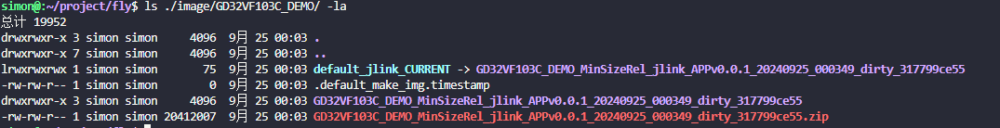
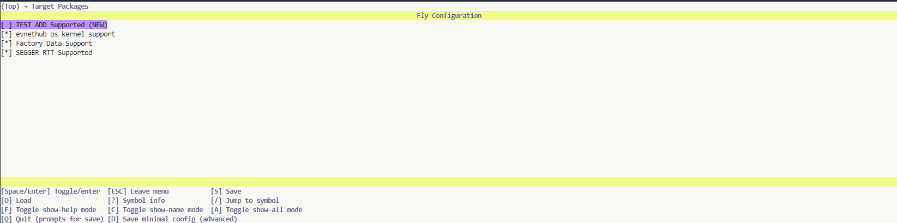
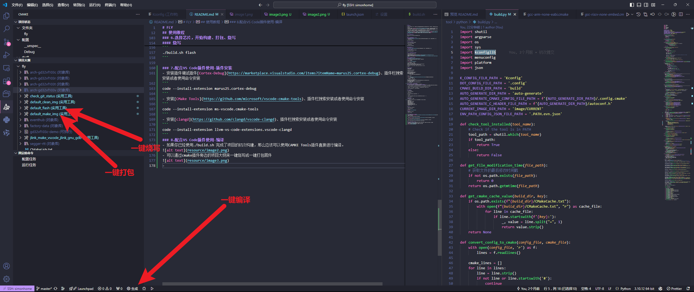
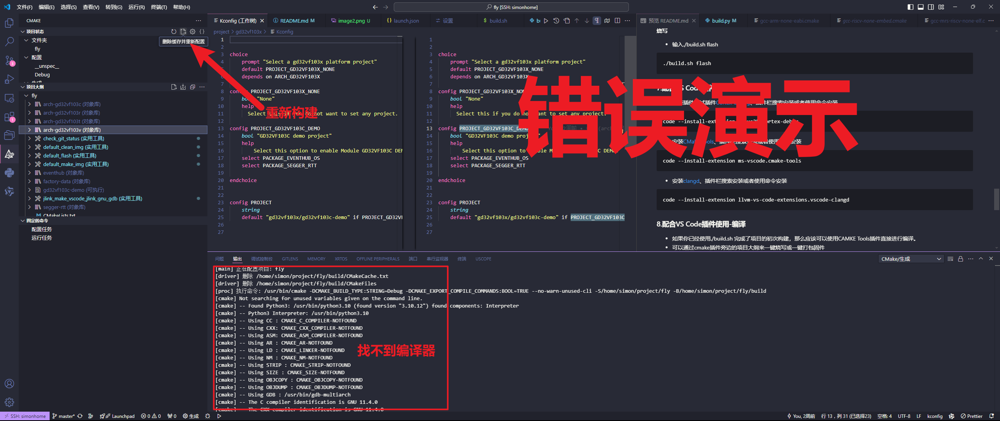
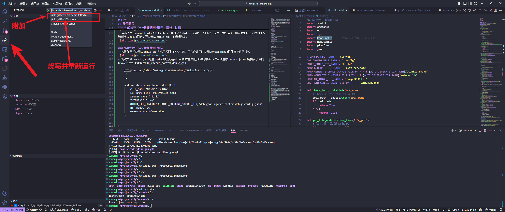

# FLY

## 项目介绍

本项目为单片机提供一站式开发平台，包括：编译、烧写、调试、发布打包等功能，可以在多个平台下进行编译，如：linux、windows(macos待验证)。

本项目的前身本来是为[eventhub-os](https://github.com/xiaoapeng/eventhub_os)做的一些验证demo，因为不想重复的维护多个仓库，想从重复的工作解脱出来(复制、粘贴、编写launch.json)，慢慢的发展成了现在这个样子。

本项目由cmake和一系列python脚本组成，使用Kconfig系统管理配置，可以通过./build.sh menuconfig(./build.bat menuconfig)来使能和失能包，且本项目支持在多个平台下进行交叉编译，如：linux、windows(macos待验证)。

站在巨人的肩膀上，配合vscode使用，可以擦出哪些火花呢？本项目可以搭配vscode插件[Cortex-Debug](https://github.com/Marus/cortex-debug.git)、[CMake Tools](https://github.com/microsoft/vscode-cmake-tools)、[clangd](https://github.com/clangd/vscode-clangd),实现一键编译、一键烧写、一键调试、一键发布打包、完美跳转等功能。

## 使用教程

### 1. clone项目到本地

```bash
git clone https://github.com/xiaoapeng/fly.git
cd fly
```

### 2. 安装必要python3环境和部分库

#### windows 安装python

- [下载](https://www.python.org/downloads/)python,安装时(或安装后)请将python加入全局环境变量，并重启设备。
- 安装kconfiglib

    ```bash
    pip install kconfiglib
    ```

#### ubuntu 安装python

- 运行 sudo apt install python3

    ```bash
    sudo apt install python3
    ```

- 安装kconfiglib

    ```bash
    pip3 install kconfiglib
    ```

### 3.安装cmake

#### windows 安装cmake

- [下载](https://cmake.org/download/)cmake,安装时请将cmake加入全局环境变量，并重启设备。

#### linux 安装cmake

- 使用命令 sudo apt install cmake

    ```bash
    sudo apt install cmake
    ```

### 4. 根据项目需要下载交叉编译器

下载后请自行解压到你自定义的安装目录。

|平台|交叉编译器前缀|下载链接|
| --- | --- | --- |
|stm32fx<br>gd32fx<br>mcxn947|arm-none-eabi|[下载](https://developer.arm.com/downloads/-/gnu-rm)|
|ch58x|riscv-none-elf|[下载](http://www.mounriver.com/download/)|
|gd32vfx|riscv-none-embed|[下载](https://github.com/xpack-dev-tools/riscv-none-embed-gcc-xpack/releases/tag/v10.2.0-1.2)|

### 5. 根据项目需要下载调试器-Jlink

- [下载](https://www.segger.com/downloads/jlink/)
后进行安装，不同平台直接安装方式略有差别，请自行百度(谷歌)。

    windows 安装成功后

    

    linux安装成功后运行 JLinkExe

    ```bash
    user@:~/project/fly$ JLinkExe 
    SEGGER J-Link Commander V7.98h (Compiled Sep 11 2024 14:26:16)
    DLL version V7.98h, compiled Sep 11 2024 14:25:50

    Connecting to J-Link via USB...FAILED: Cannot connect to J-Link.
    J-Link>
    ```

### 6. 根据项目需要下载调试器-openocd

#### ubuntu  安装方式

- 使用如下命令

    ```bash
    sudo apt install  openocd
    ```

- 安装成功后运行如下命令

    ```bash
    simon@:~/project/fly$ openocd -v 
    Open On-Chip Debugger 0.11.0
    Licensed under GNU GPL v2
    For bug reports, read
            http://openocd.org/doc/doxygen/bugs.html
    ```

#### windows 安装方式

- [下载](https://github.com/xpack-dev-tools/openocd-xpack/releases)后解压到你自定义的安装目录。
- 添加进环境变量并重启设备

- 安装成功后打开cmd运行命令

    ```bash
    PS C:\Users\user> openocd.exe -v
    xPack Open On-Chip Debugger 0.12.0+dev-01685-gb9224c0c0-dirty (2024-08-02-19:51)
    Licensed under GNU GPL v2
    For bug reports, read
            http://openocd.org/doc/doxygen/bugs.html
    PS C:\Users\user>
    ```

### 7. 选择芯片，开始构建、打包、烧写

<p><span style="color: yellow;">构建时 windows使用build.bat脚本，linux使用build.sh脚本</span></p>

#### 构建前准备，只需要执行一次（执行后环境变量会存储到 .PATH.evn.json中）

- 添加编译器路径到FLY,添加的路径请根据你安装的路径进行添加，若路径有空格，请用引号包裹路径。(注意，路径应该要加上bin目录)

    ```bash
    ./build.sh add_path_env /home/xxx/xxxx/toolchain/riscv-none-embed-gcc-10.1.0-1.1/bin/
    ```

- 若没有添加仿真器程序到全局路径，请将他们也使用add_path_env添加到FLY环境中。

    ```bash
    ./build.sh add_path_env   /xxxx/xxx/openocd/
    ```

#### 选择项目

- 打开menuconfig

    ```bash
    ./build.sh menuconfig
    ```

- 分别选择Arch

    ```bash
    Select CPU Architecture (gd32vf103x)  --->
    ```

- 选择项目

    ```bash
    - Select a gd32vf103x platform project (GD32VF103C demo project)  --->
    ```

- 按ESC后选择Y保存退出

#### 编译项目

- 输入./build.sh进行编译

    ```bash
    # 一般直接运行/build.sh 会使用上一次选择的编译类型, 默认使用Release
    ./build.sh
    # 编译为Release
    ./build.sh build Release
    # 编译为Debug
    ./build.sh build Debug
    # 编译为MinSizeRel
    ./build.sh build  MinSizeRel
    # -j可以指定作业数量
    ./build.sh build  MinSizeRel -j 44
    ./build.sh -j 44
    ```

#### 打包

- 输入./build.sh make_img

    ```bash
    ./build.sh make_img
    ```

- 查看打包


#### 烧写

- 输入./build.sh flash

    ```bash
    ./build.sh flash
    ```

#### 配置保存

如果进行复制的menuconfig配置后，如何保存配置呢

- 输入./build.sh saveconfig, 可自动保存配置

    ```bash
    # 自动保存到项目文件夹下的defconfig文件里面
    ./build.sh saveconfig
    # 自定义文件名称
    ./build.sh saveconfig xxconfig
    ```

#### 配置文件加载

- 输入./build.sh loadconfig ./project/xxxx/xxxx/defconfig

    ```bash
    # 以./project/gd32f10x/gd32f103-demo/defconfig 举例， 必须输入绝对或者相对目录
    ./build.sh loadconfig ./project/gd32f10x/gd32f103-demo/defconfig
    ```

### 8. 新建项目

以新建一个gd32vf103x的项目为例

- 进入project/gd32vf103x目录
- 修改Kconfig,新建一个项 PROJECT_TEST_DEMO

    ```Kconfig
    choice
    prompt "Select a gd32vf103x platform project"
    default PROJECT_GD32VF103X_NONE
    depends on ARCH_GD32VF103X

    config PROJECT_GD32VF103X_NONE
        bool "None"
        help
        Select this if you do not want to set any project.

    config PROJECT_GD32VF103C_DEMO
        bool "GD32VF103C demo project"
        help
            Select this option to enable Module GD32VF103C DEMO.
        select PACKAGE_EVENTHUB_OS
        select PACKAGE_SEGGER_RTT

    # 新建 TEST_DEMO
    config PROJECT_TEST_DEMO
        bool "TEST demo project"
        help
            Select this option to enable Module TEST DEMO.
    # 这里根据需要的包来添加默认依赖(包名请去看package/xxx/Kconfig里面有定义包的名称)
        select PACKAGE_EVENTHUB_OS
        select PACKAGE_SEGGER_RTT

        
    endchoice

    config PROJECT
        string
        default "gd32vf103x/gd32vf103c-demo" if PROJECT_GD32VF103C_DEMO
    # 设置 TEST_DEMO 的项目路径，项目路径以project文件夹的路径为基路径
        default "gd32vf103x/test-demo" if PROJECT_TEST_DEMO
    ```

- 复制gd32vf103c-demo 为 test-demo

    虽然复制了gd32vf103c-demo,但是项目名称和目标名称还是没有变，需要进入test-demo来进行修改project/gd32vf103x/test-demo/CMakeLists.txt，需要了解一些cmake语法。

    ```cmake
    cmake_minimum_required(VERSION 3.5)

    project(test-demo LANGUAGES C CXX ASM)

    set(TARGET_FLAGS 
        "-Wall"
        "-Wextra"
        "-Wconversion"
        "-Wsign-conversion"
        "-Wno-psabi"
    )


    target_include_directories(arch-gd32vf103c PRIVATE "${CMAKE_CURRENT_SOURCE_DIR}/board/inc/")
    target_include_directories(eventhub PUBLIC "${CMAKE_CURRENT_SOURCE_DIR}/config-inc")

    # app程序生成
    add_executable(test-demo)
    target_include_directories(test-demo PUBLIC "${CMAKE_CURRENT_SOURCE_DIR}/board/inc/")

    target_link_libraries(test-demo  arch-gd32vf103c segger-rtt factory-data eventhub c )

    target_sources(test-demo PRIVATE 
        "${CMAKE_CURRENT_SOURCE_DIR}/app/main.c"
        "${CMAKE_CURRENT_SOURCE_DIR}/board/init.c"
        "${CMAKE_CURRENT_SOURCE_DIR}/board/system_gd32vf103.c"
        "${CMAKE_CURRENT_SOURCE_DIR}/board/led.c"
        "${CMAKE_CURRENT_SOURCE_DIR}/board/button.c"
    )

    target_compile_options(test-demo PRIVATE "${TARGET_FLAGS}")
    target_link_options(test-demo  PRIVATE
        "-T${CMAKE_CURRENT_SOURCE_DIR}/app/GD32VF103xB.lds"
    )
        
    # 自动生成map
    add_target_make_map(test-demo)
    # 自动生成bin
    add_target_make_bin(test-demo)
    # 自动打印内存/存储占用
    add_target_print_memory_usage(test-demo)

    add_jlink_image( default
        IMAGE_NAME "TEST_DEMO"
        CHIP_NAME "GD32VF103CBT6"
        INTERFACE "jtag"
        SPEED "10000"
        FIRMWARE_LIST "APP:V0.0.1:0x08000000:test-demo.bin"
        DEPENDS test-demo
    )

    add_vscode_cortex_debug_gdb( jlink
        CHIP_NAME "GD32VF103CBT6"
        ELF_NAME_LIST "test-demo"
        SERVER_TYPE "jlink"
        INTERFACE "jtag"
        OTHER_EXT_CONFIG "${CMAKE_CURRENT_SOURCE_DIR}/debugconfig/ext-cortex-debug-config.json"
        RTT_DEBUG  ON
        DEPENDS test-demo
    )
    ```

- 回到顶层目录，重新使用./build.sh menuconfig选择刚刚新增的项目，再开始编译

    ```bash
    # ./build.sh
    simon@:~/project/fly$ ./build.sh  
    [  8%] Building C object package/segger-rtt/CMakeFiles/segger-rtt.dir/SEGGER_RTT.c.obj
    [  8%]  
    [  8%] Building C object package/factory-data/CMakeFiles/factory-data.dir/factory-data.c.obj
    [  8%] Building C object package_build/packge-eventhub-os/src/CMakeFiles/eventhub.dir/coroutine/riscv32-bumblebee-n200/coroutine.c.obj
    [ 11%] Building ASM object package_build/packge-eventhub-os/src/CMakeFiles/eventhub.dir/coroutine/riscv32-bumblebee-n200/coroutine.S.obj
    [ 14%] Building C object package_build/packge-eventhub-os/src/CMakeFiles/eventhub.dir/general/eh_rbtree.c.obj
    [ 14%] Building C object package_build/packge-eventhub-os/src/CMakeFiles/eventhub.dir/platform/riscv32-bumblebee-n200/platform.c.obj
    [ 14%] Building C object package_build/packge-eventhub-os/src/CMakeFiles/eventhub.dir/general/eh_formatio.c.obj
    [ 17%] Building C object package_build/packge-eventhub-os/src/CMakeFiles/eventhub.dir/general/eh_debug.c.obj
    [ 20%] Building C object package_build/packge-eventhub-os/src/CMakeFiles/eventhub.dir/general/eh_ringbuf.c.obj
    [ 20%] Building C object package_build/packge-eventhub-os/src/CMakeFiles/eventhub.dir/eh_core.c.obj
    [ 22%] Building C object package_build/packge-eventhub-os/src/CMakeFiles/eventhub.dir/eh_timer.c.obj
    [ 25%] Building C object package_build/packge-eventhub-os/src/CMakeFiles/eventhub.dir/eh_sleep.c.obj
    [ 25%] Building C object package_build/packge-eventhub-os/src/CMakeFiles/eventhub.dir/eh_event.c.obj
    [ 28%] Building C object package_build/packge-eventhub-os/src/CMakeFiles/eventhub.dir/eh_event_cb.c.obj
    [ 28%] Building ASM object arch/gd32/risc-v/gd32vf103/CMakeFiles/arch-gd32vf103c.dir/RISCV/env_Eclipse/start.S.obj
    Git status changed to 'dirty'. Timestamp updated.
    [ 28%] Built target check_git_status
    [ 28%] Building C object package_build/packge-eventhub-os/src/CMakeFiles/eventhub.dir/eh_mutex.c.obj
    [ 31%] Building ASM object arch/gd32/risc-v/gd32vf103/CMakeFiles/arch-gd32vf103c.dir/RISCV/env_Eclipse/entry.S.obj
    [ 34%] Building C object package_build/packge-eventhub-os/src/CMakeFiles/eventhub.dir/eh_sem.c.obj
    [ 34%] Building C object arch/gd32/risc-v/gd32vf103/CMakeFiles/arch-gd32vf103c.dir/GD32VF103_standard_peripheral/Source/gd32vf103_adc.c.obj
    [ 34%] Built target factory-data
    [ 34%] Building C object package_build/packge-eventhub-os/src/CMakeFiles/eventhub.dir/eh_mem.c.obj
    [ 37%] Building C object arch/gd32/risc-v/gd32vf103/CMakeFiles/arch-gd32vf103c.dir/GD32VF103_standard_peripheral/Source/gd32vf103_bkp.c.obj
    [ 37%] Building C object arch/gd32/risc-v/gd32vf103/CMakeFiles/arch-gd32vf103c.dir/GD32VF103_standard_peripheral/Source/gd32vf103_can.c.obj
    [ 40%] Building C object arch/gd32/risc-v/gd32vf103/CMakeFiles/arch-gd32vf103c.dir/GD32VF103_standard_peripheral/Source/gd32vf103_crc.c.obj
    [ 42%] Building C object arch/gd32/risc-v/gd32vf103/CMakeFiles/arch-gd32vf103c.dir/GD32VF103_standard_peripheral/Source/gd32vf103_dac.c.obj
    [ 42%] Building C object arch/gd32/risc-v/gd32vf103/CMakeFiles/arch-gd32vf103c.dir/GD32VF103_standard_peripheral/Source/gd32vf103_dbg.c.obj
    [ 45%] Building C object arch/gd32/risc-v/gd32vf103/CMakeFiles/arch-gd32vf103c.dir/GD32VF103_standard_peripheral/Source/gd32vf103_dma.c.obj
    [ 45%] Building C object arch/gd32/risc-v/gd32vf103/CMakeFiles/arch-gd32vf103c.dir/GD32VF103_standard_peripheral/Source/gd32vf103_eclic.c.obj
    [ 48%] Building C object arch/gd32/risc-v/gd32vf103/CMakeFiles/arch-gd32vf103c.dir/GD32VF103_standard_peripheral/Source/gd32vf103_exmc.c.obj
    [ 48%] Building C object arch/gd32/risc-v/gd32vf103/CMakeFiles/arch-gd32vf103c.dir/GD32VF103_standard_peripheral/Source/gd32vf103_exti.c.obj
    [ 51%] Building C object arch/gd32/risc-v/gd32vf103/CMakeFiles/arch-gd32vf103c.dir/GD32VF103_standard_peripheral/Source/gd32vf103_fmc.c.obj
    [ 54%] Building C object arch/gd32/risc-v/gd32vf103/CMakeFiles/arch-gd32vf103c.dir/GD32VF103_standard_peripheral/Source/gd32vf103_fwdgt.c.obj
    [ 54%] Building C object arch/gd32/risc-v/gd32vf103/CMakeFiles/arch-gd32vf103c.dir/GD32VF103_standard_peripheral/Source/gd32vf103_gpio.c.obj
    [ 57%] Building C object arch/gd32/risc-v/gd32vf103/CMakeFiles/arch-gd32vf103c.dir/GD32VF103_standard_peripheral/Source/gd32vf103_i2c.c.obj
    [ 60%] Building C object arch/gd32/risc-v/gd32vf103/CMakeFiles/arch-gd32vf103c.dir/GD32VF103_standard_peripheral/Source/gd32vf103_rcu.c.obj
    [ 60%] Building C object arch/gd32/risc-v/gd32vf103/CMakeFiles/arch-gd32vf103c.dir/GD32VF103_standard_peripheral/Source/gd32vf103_pmu.c.obj
    [ 62%] Building C object arch/gd32/risc-v/gd32vf103/CMakeFiles/arch-gd32vf103c.dir/GD32VF103_standard_peripheral/Source/gd32vf103_rtc.c.obj
    [ 62%] Building C object arch/gd32/risc-v/gd32vf103/CMakeFiles/arch-gd32vf103c.dir/GD32VF103_standard_peripheral/Source/gd32vf103_spi.c.obj
    [ 62%] Built target segger-rtt
    [ 65%] Building C object arch/gd32/risc-v/gd32vf103/CMakeFiles/arch-gd32vf103c.dir/GD32VF103_standard_peripheral/Source/gd32vf103_timer.c.obj
    [ 68%] Building C object arch/gd32/risc-v/gd32vf103/CMakeFiles/arch-gd32vf103c.dir/GD32VF103_standard_peripheral/Source/gd32vf103_usart.c.obj
    [ 68%] Building C object arch/gd32/risc-v/gd32vf103/CMakeFiles/arch-gd32vf103c.dir/GD32VF103_standard_peripheral/Source/gd32vf103_wwdgt.c.obj
    [ 68%] Building C object arch/gd32/risc-v/gd32vf103/CMakeFiles/arch-gd32vf103c.dir/RISCV/drivers/n200_func.c.obj
    [ 71%] Building C object arch/gd32/risc-v/gd32vf103/CMakeFiles/arch-gd32vf103c.dir/RISCV/env_Eclipse/your_printf.c.obj
    [ 74%] Building C object arch/gd32/risc-v/gd32vf103/CMakeFiles/arch-gd32vf103c.dir/RISCV/stubs/_exit.c.obj
    [ 77%] Building C object arch/gd32/risc-v/gd32vf103/CMakeFiles/arch-gd32vf103c.dir/RISCV/env_Eclipse/init.c.obj
    [ 71%] Building C object arch/gd32/risc-v/gd32vf103/CMakeFiles/arch-gd32vf103c.dir/RISCV/env_Eclipse/handlers.c.obj
    [ 80%] Building C object arch/gd32/risc-v/gd32vf103/CMakeFiles/arch-gd32vf103c.dir/RISCV/stubs/close.c.obj
    [ 80%] Building C object arch/gd32/risc-v/gd32vf103/CMakeFiles/arch-gd32vf103c.dir/RISCV/stubs/fstat.c.obj
    [ 82%] Building C object arch/gd32/risc-v/gd32vf103/CMakeFiles/arch-gd32vf103c.dir/RISCV/stubs/isatty.c.obj
    [ 82%] Building C object arch/gd32/risc-v/gd32vf103/CMakeFiles/arch-gd32vf103c.dir/RISCV/stubs/sbrk.c.obj
    [ 82%] Building C object arch/gd32/risc-v/gd32vf103/CMakeFiles/arch-gd32vf103c.dir/RISCV/stubs/lseek.c.obj
    [ 85%] Building C object arch/gd32/risc-v/gd32vf103/CMakeFiles/arch-gd32vf103c.dir/RISCV/stubs/read.c.obj
    [ 85%] Building C object arch/gd32/risc-v/gd32vf103/CMakeFiles/arch-gd32vf103c.dir/RISCV/stubs/write_hex.c.obj
    [ 88%] Building C object arch/gd32/risc-v/gd32vf103/CMakeFiles/arch-gd32vf103c.dir/RISCV/stubs/write.c.obj
    [ 88%] Built target arch-gd32vf103c
    [ 88%] Built target eventhub
    [ 88%] Building C object project/gd32vf103x/test-demo/CMakeFiles/test-demo.dir/board/init.c.obj
    [ 91%] Building C object project/gd32vf103x/test-demo/CMakeFiles/test-demo.dir/app/main.c.obj
    [ 94%] Building C object project/gd32vf103x/test-demo/CMakeFiles/test-demo.dir/board/system_gd32vf103.c.obj
    [ 94%] Building C object project/gd32vf103x/test-demo/CMakeFiles/test-demo.dir/board/led.c.obj
    [ 97%] Building C object project/gd32vf103x/test-demo/CMakeFiles/test-demo.dir/board/button.c.obj
    [100%] Linking C executable test-demo
    Memory region         Used Size  Region Size  %age Used
            flash:       48084 B       128 KB     36.69%
                ram:         32 KB        32 KB    100.00%
    Building test-demo
    Building test-demo.bin
    text    data     bss     dec     hex filename
    46718    1360   16508   64586    fc4a /home/simon/project/fly/build/project/gd32vf103x/test-demo/test-demo
    [100%] Built target test-demo
    [100%] :Make vscode jlink gnu gdb
    [100%] Built target jlink_make_vscode_jlink_gnu_gdb
    ```

### 9. 新建一个可被复用的源码包

#### 包的结构

一个包是由CMakeLists.txt 和 Kconfig组成的一系列文件,下面是segger-rtt包的结构

```txt
simon@:~/fly/package/segger-rtt$ tree 
.
├── CMakeLists.txt               # CMakeList.txt 提供给CMake使用
├── inc
│   ├── SEGGER_RTT_Conf.h
│   └── SEGGER_RTT.h
├── Kconfig                      # Kconfig 提供给menuconfig来提供配置项
└── SEGGER_RTT.c
```

#### 新建一个可复用的源码包

- 假设有以下源码想作为一个可复用的包

    ```c
    /* add.h */
    #ifndef _ADD_H_
    #define _ADD_H_

    extern int      add_int(int a, int b);
    extern double   add_double(double a, double b);

    #endif /* _ADD_H_ */
    ```

    ```c
    /* add.c */

    int add_int(int a, int b){
        return a+b;
    }

    double add_double(double a, double b){
        return a+b;
    }

    ```

- 在fly/package下新建一个名为add的包

    ```bash
    mkdir add
    cd add
    touch Kconfig CMakeLists.txt add.c 
    mkdir inc
    touch inc/add.h
    ```

- 编写源码add.h和add.c
- 编写Kconfig，这里包名为PACKAGE_TEST_ADD

    ```Kconfig
    config PACKAGE_TEST_ADD
            bool "TEST ADD Supported"
        help
            "TEST ADD Supported"
    ```

- 编写CMakeLists.txt

    ```cmake
    cmake_minimum_required(VERSION 3.5)

    # 如果没有使能这个配置，就不要add_library
    if(CONFIG_PACKAGE_TEST_ADD)

        # 相当于向全局声明test-add这个库，test-add的属性为编译单元(.o)
        add_library(test-add OBJECT)

        # 为test-add库添加源码
        target_sources(test-add PRIVATE
            ${CMAKE_CURRENT_LIST_DIR}/add.c
        )

        # 为test-add库添加头文件，这里使用PUBLIC，意味着依赖这个库的都可以访问到这个文件夹下的头文件
        target_include_directories(test-add PUBLIC "${CMAKE_CURRENT_SOURCE_DIR}/inc/")

    endif(CONFIG_PACKAGE_TEST_ADD)
    ```

- 测试menuconfig中是否存在我们的自定义包,如果看到我们的测试包，那么说明建包成功。

    ```txt
    Target Packages -->
        [ ] TEST ADD Supported (NEW)
    ```

    

- 在项目中使用包，这里以project/gd32vf103x/gd32vf103c-demo为例，来使用test-add这个包
  - 修改项目目录下的target_link_libraries添加test-add这个包
  
    这里的包名使用上面add_library(test-add OBJECT)定义的test-add。(这里的包名不是包文件夹名称，而是cmake中add_library的名称哦)。

    ```cmake
    ...

    # app程序生成
    add_executable(gd32vf103c-demo)
    target_include_directories(gd32vf103c-demo PUBLIC "${CMAKE_CURRENT_SOURCE_DIR}/board/inc/")

    target_link_libraries(gd32vf103c-demo  arch-gd32vf103c test-add segger-rtt factory-data eventhub c )

    target_sources(gd32vf103c-demo PRIVATE 
        "${CMAKE_CURRENT_SOURCE_DIR}/app/main.c"
        "${CMAKE_CURRENT_SOURCE_DIR}/board/init.c"
        "${CMAKE_CURRENT_SOURCE_DIR}/board/system_gd32vf103.c"
        "${CMAKE_CURRENT_SOURCE_DIR}/board/led.c"
        "${CMAKE_CURRENT_SOURCE_DIR}/board/button.c"
    )

    ...
    ```

  - 假如有些包需要用户来提供某个头文件给它(例子中不需要，下面只是演示)，可是使用target_include_directories给包传递你的头文件目录

    ```cmake
    ...

    # 在项目的CMakeLists.txt中给外部的包添加include目录
    target_include_directories(test-add PUBLIC "${CMAKE_CURRENT_SOURCE_DIR}/config-inc")

    # app程序生成
    add_executable(gd32vf103c-demo)
    target_include_directories(gd32vf103c-demo PUBLIC "${CMAKE_CURRENT_SOURCE_DIR}/board/inc/")

    target_link_libraries(gd32vf103c-demo  arch-gd32vf103c test-add segger-rtt factory-data eventhub c )

    target_sources(gd32vf103c-demo PRIVATE 
        "${CMAKE_CURRENT_SOURCE_DIR}/app/main.c"
        "${CMAKE_CURRENT_SOURCE_DIR}/board/init.c"
        "${CMAKE_CURRENT_SOURCE_DIR}/board/system_gd32vf103.c"
        "${CMAKE_CURRENT_SOURCE_DIR}/board/led.c"
        "${CMAKE_CURRENT_SOURCE_DIR}/board/button.c"
    )

    ...
    ```

  - 假如有些包需要用户定义一些宏，可以使用target_compile_definitions给包传递你宏定义

    ```cmake
    ...

    # 在项目的CMakeLists.txt中给外部的包添加宏定义
    target_compile_definitions(test-add PUBLIC -DTEST1=1 -DTEST_STR="test-str" )

    # app程序生成
    add_executable(gd32vf103c-demo)
    target_include_directories(gd32vf103c-demo PUBLIC "${CMAKE_CURRENT_SOURCE_DIR}/board/inc/")

    target_link_libraries(gd32vf103c-demo  arch-gd32vf103c test-add segger-rtt factory-data eventhub c )

    target_sources(gd32vf103c-demo PRIVATE 
        "${CMAKE_CURRENT_SOURCE_DIR}/app/main.c"
        "${CMAKE_CURRENT_SOURCE_DIR}/board/init.c"
        "${CMAKE_CURRENT_SOURCE_DIR}/board/system_gd32vf103.c"
        "${CMAKE_CURRENT_SOURCE_DIR}/board/led.c"
        "${CMAKE_CURRENT_SOURCE_DIR}/board/button.c"
    )

    ...
    ```

  - 在源码中使用test-add包提供的函数

    ```c
    ...
    
    #include "add.h"
    ...
        print_factory_data();
        eh_infofl("test add int 3+4=%d", add_int(3, 4));
        eh_infofl("test add double 3.3+4.4=%f", add_double(3.3, 4.4));
        eh_global_init();
    ...

    ```

  - 添加依赖项PACKAGE_TEST_ADD，使代码编译时自动选上test-add包。修改项目上级目录的Kconfig

    ```Kconfig
    choice
        prompt "Select a gd32vf103x platform project"
        default PROJECT_GD32VF103X_NONE
        depends on ARCH_GD32VF103X

    config PROJECT_GD32VF103X_NONE
        bool "None"
        help
        Select this if you do not want to set any project.

    config PROJECT_GD32VF103C_DEMO
        bool "GD32VF103C demo project"
        help
            Select this option to enable Module GD32VF103C DEMO.
        select PACKAGE_EVENTHUB_OS
        select PACKAGE_SEGGER_RTT
    # 添加依赖包 PACKAGE_TEST_ADD
        select PACKAGE_TEST_ADD
        
    endchoice


    config PROJECT
        string
        default "gd32vf103x/gd32vf103c-demo" if PROJECT_GD32VF103C_DEMO

    ```

  - 由于修改了Kconfig,刷新一下menuconfig，如果没有选gd32vf103c-demo请选中gd32vf103c-demo使其生成正确的配置

    ```bash
    ./build.sh menuconfig #进入后选择gd32vf103c-demo后 按ESC 选Y后退出
    ```

  - 使用./build.sh 开始编译

    ```bash
    ./build.sh
    ```

  - 使用./build.sh flash烧写后使用 ./build.sh rttlog查看日志

    ```log
    [2024-09-29 23:36:30.305] [    0.091618] [INFO] firmware_name:GD32VF103C_DEMO_Debug
    [2024-09-29 23:36:30.306] [    0.091750] [INFO] part_name:APP
    [2024-09-29 23:36:30.307] [    0.091857] [INFO] version:V0.0.1
    [2024-09-29 23:36:30.308] [    0.091994] [INFO] generated_description:git@dirty_b02e985287 time@20240929_233524
    [2024-09-29 23:36:30.309] [    0.092150] [INFO] software_len:48344
    [2024-09-29 23:36:30.310] [    0.092296] [INFO] [main, 113]: app start!
    [2024-09-29 23:36:30.311] [    0.092435] [INFO] [main, 114]: test add int 3+4=7
    [2024-09-29 23:36:30.312] [    0.092592] [INFO] [main, 115]: test add double 3.3+4.4=7.700000
    [2024-09-29 23:36:30.574] [    1.092904] [INFO] slot_test_function timer-1000ms
    ```

### 10. 配合VS Code插件使用-插件安装

- 安装插件调试插件[Cortex-Debug](https://marketplace.visualstudio.com/items?itemName=marus25.cortex-debug)、插件栏搜索安装或者使用命令安装 

    ```bash
    code --install-extension marus25.cortex-debug
    ```

- 安装[CMake Tools](https://github.com/microsoft/vscode-cmake-tools)、插件栏搜索安装或者使用命令安装

    ```bash
    code --install-extension ms-vscode.cmake-tools
    ```

- 安装[clangd](https://github.com/clangd/vscode-clangd)、插件栏搜索安装或者使用命令安装

    ```bash
    code --install-extension llvm-vs-code-extensions.vscode-clangd
    ```

### 11. 配合VS Code插件使用-编译、烧写、打包

- 如果你已经使用./build.sh 完成了项目的初次构建，那么应该可以使用CAMKE Tools插件直接进行编译。
- 可以通过cmake插件旁边的项目大纲来一键烧写或一键打包固件

- 请不要使用cmake tools插件进行配置，可能会找不到编译器(除非编译器在全局环境变量)，如果发生配置失败的情况，请删除./build目录，再使用./build.sh进行重新构建。

- 打包固件使用命名规则 <IMAGE_NAME>_<CMAKE_BUILD_TYPE>_<BURN_MODE>_<PARTITION_1_NAME>v<PARTITION_1_VERSION>..._[<PARTITION_x_NAME>v<PARTITION_x_VERSION>]_<MAKE_IMG_TIME>_[dirty]_<GIT_COMMIT_HASH>, 该这些内容在项目的CMakeLists.txt文件中指定：

    ```cmake

    # OPENOCD固件
    # STM32F030X8_DEMO_APP__openocd_APPv0.0.1_20240928_150140_dirty_9bf0eb71fd 是 在cmake中调用这个函数生成的
    add_openocd_image( openocd_image
        IMAGE_NAME "STM32F030X8_DEMO_APP"
        RTT_ADDR_AND_SIZE 0x20000000 0x3000
        CONFIGFILE_LIST "${CMAKE_CURRENT_SOURCE_DIR}/openocd/jlink.cfg"
        # 固件表，可以包含不止一个固件多个固件用空格隔开即可,比如
        # FIRMWARE_LIST "BOOT:V0.0.1:0x8000000:stm32f030x8_demo_boot.bin" "APP:V0.0.1:0x8004000:stm32f030x8_demo_app.bin"
        FIRMWARE_LIST "APP:V0.0.1:0x8000000:stm32f030x8_demo_app.bin"
        DEPENDS stm32f030x8_demo_app
    )

    # JLINK固件
    # STM32F030X8_DEMO_APP__jlink_APPv0.0.1_20240928_150140_dirty_9bf0eb71fd 是 在cmake中调用这个函数生成的
    # 这里的目标名称叫default，意味着./build.sh make_img会依赖该目标，该目标又依赖了openocd_image_make_img(上面openocd目标)，所以
    add_jlink_image( default
        IMAGE_NAME "STM32F030X8_DEMO_APP"
        CHIP_NAME "STM32F030C8"
        # 固件表，可以包含不止一个固件多个固件用空格隔开即可,比如
        # FIRMWARE_LIST "BOOT:V0.0.1:0x8000000:stm32f030x8_demo_boot.bin" "APP:V0.0.1:0x8004000:stm32f030x8_demo_app.bin"
        FIRMWARE_LIST "APP:V0.0.1:0x8000000:stm32f030x8_demo_app.bin"
        # 依赖上面的openocd_image目标，当该目标被生成时上面的目标也可以被生成。
        DEPENDS stm32f030x8_demo_app openocd_image_make_img
    )

    

    ```

- 打包img包各文件解释(jlink包为例)

    ```txt
    ├── APP.bin                                             # 分区固件
    ├── burn.bat                                            # 在windows下的烧写脚本
    ├── burn.sh                                             # 在linux下的烧写脚本
    ├── download.jlink
    ├── log.bat                                             # 在windows下日志抓取脚本
    ├── log.ps1
    ├── log.sh                                              # 在linux下日志烧写脚本
    └── tool
        ├── JLinkARM.dll
        ├── JLink.exe
        ├── 
    ```

### 12. 配合VS Code插件使用-调试

- 如果你已经使用./build.sh 完成了项目的初次构建，那么应该可以使用Cortex-Debug插件直接进行调试。

- 调试文件launch.json是由cmake函数调用python脚本生成的,如果想要编译时自动生成launch.json，需要在项目的CMakeLists.txt调用add_vscode_cortex_debug_gdb

    这里以project/gd32vf103x/gd32vf103c-demo/CMakeLists.txt为例：

    ```cmake
    ...
    
    add_vscode_cortex_debug_gdb( jlink
        CHIP_NAME "GD32VF103CBT6"
        ELF_NAME_LIST "gd32vf103c-demo"
        SERVER_TYPE "jlink"
        INTERFACE "jtag"
        OTHER_EXT_CONFIG "${CMAKE_CURRENT_SOURCE_DIR}/debugconfig/ext-cortex-debug-config.json"
        RTT_DEBUG  ON
        DEPENDS gd32vf103c-demo
    )
    ```

- 调试已经支持了RTT日志的查看，你要使能RTT相关包，然后配置eventhub-os包提供的格式化输出，就能看到相关日志的输出。

    ```c
    #include "SEGGER_RTT.h"
    #include <eh.h>
    #include <eh_debug.h>

    void stdout_write(void *stream, const uint8_t *buf, size_t size){
        (void)stream;
        SEGGER_RTT_Write(0, buf, (unsigned)size);
    }
    int main(void){
        eh_infoln("hello fly!");
        return 0;
    }
    ```

### 13. 配合VS Code插件使用-LSP语法提示、跳转、代码补全

- 想用 c/c++ 插件请自行配置，略过此章。
- 如果你已经使用./build.sh 完成了项目的初次构建，应该可以使用clangd进行代码补全。
- 先在.vscode下建立.vscode/settings.json,添加如下内容。

    ```json
    "C_Cpp.intelliSenseEngine": "disabled",
    "clangd.onConfigChanged": "restart",
    "clangd.checkUpdates": false,
    "clangd.arguments": [
        // 在后台自动分析文件（基于complie_commands）
        "--background-index",
        // 同时开启的任务数量
        "-j=6",
        // 标记compelie_commands.json文件的目录位置
        "--compile-commands-dir=${workspaceFolder}/build",
        // 使用的编译器，通过编译器来寻找系统头文件位置,这里必须使用绝对路径，不能使用链接路径
        //"--query-driver=",
        // 补充头文件的形式
        /* iwyu:自动补充  never：不自动补充*/
        "--header-insertion=iwyu",
        //"--header-insertion=never",
        // pch优化的位置
        "--pch-storage=disk",
        // 全局补全（会自动补充头文件）
        "--all-scopes-completion",
        // clang-tidy功能
        "--clang-tidy",
        "--clang-tidy-checks=performance-*,bugprone-*",
        // 建议风格：打包(重载函数只会给出一个建议）
        // 相反可以设置为bundled 
        "--completion-style=detailed",
        // 跨文件重命名变量
        "--cross-file-rename",
        // 使能.cland文件
        // .clangd示例:
        //  CompileFlags:                     # Tweak the parse settings
        //      Remove: [-march=rv32imac, -mabi=ilp32] 
        //
        //"--enable-config",
    ]
    ```

- 然后使用vs code顶部命令（或者直接重启VS Code） >clangd:Restart language server 重启clangd服务，即可支持代码补全。
- 对于一些新架构，比如riscv，clangd会出现报错，在fly目录下建立.clangd文件(指定命令来移除clangd不能识别的选项)可以解决问题，比如下面的。

    ```.clangd
    # 这里就是移除了 -march=rv32imac, -mabi=ilp32，防止clangd报错
    CompileFlags:                     # Tweak the parse settings
    Remove: [-march=rv32imac, -mabi=ilp32]
    ```
